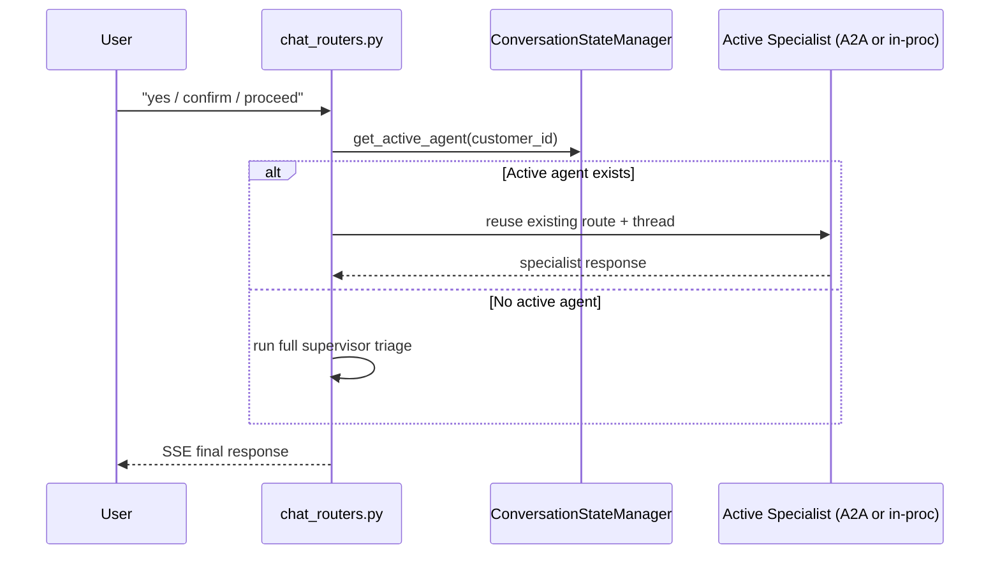
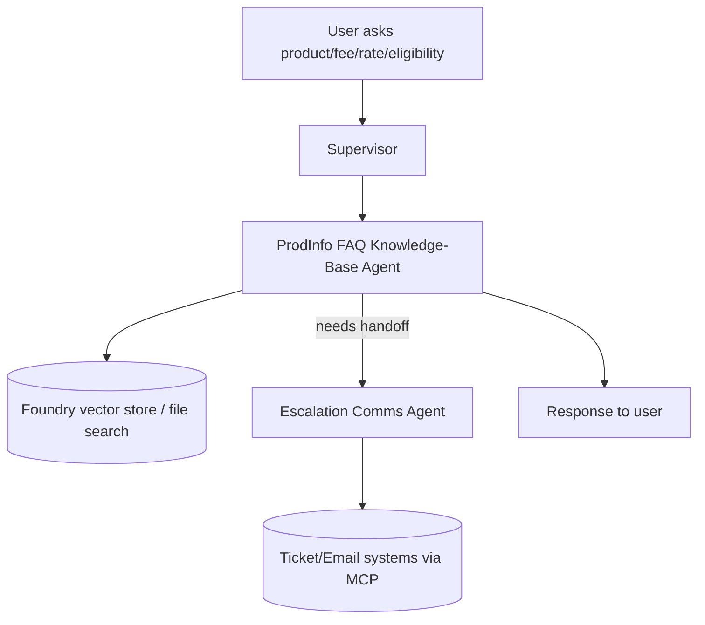
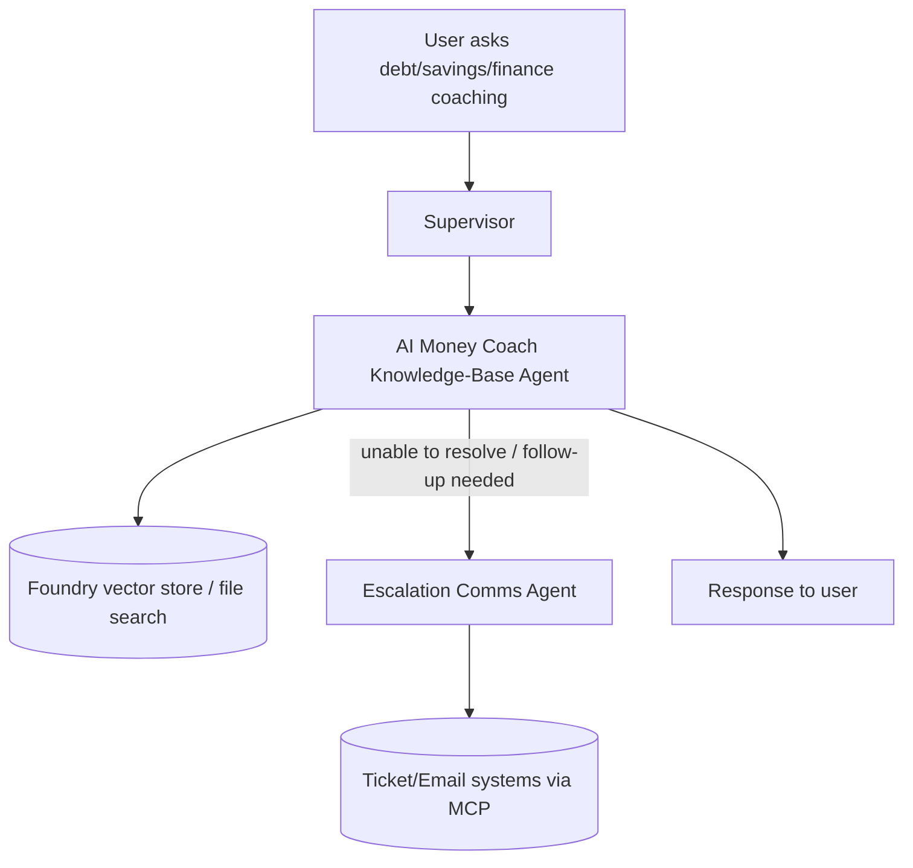
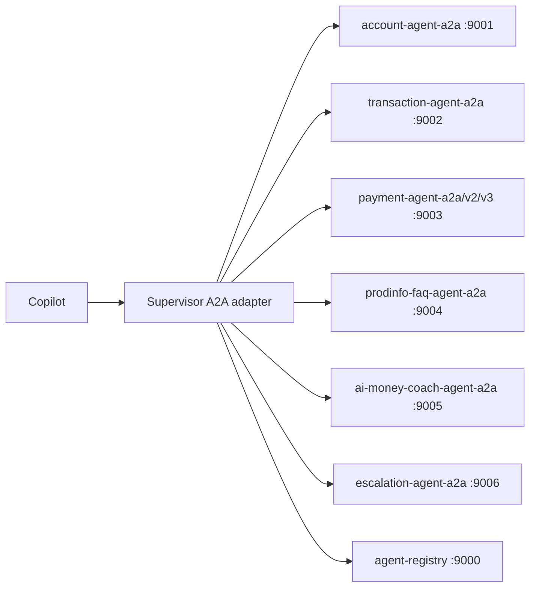
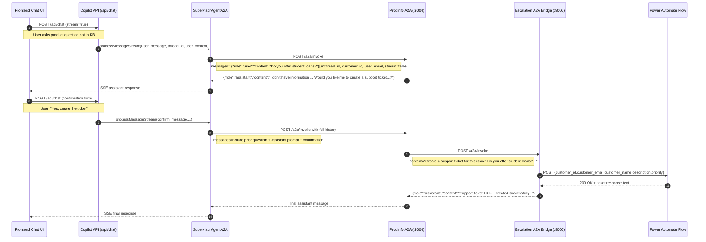

# Batch 04 — Use-Case Call Flows + Config Dependency Matrix

## A) Call-flow diagrams per use case

### UC1 — Account / Transaction / Payment (Copilot path)

```mermaid
flowchart TD
    U[User in React ChatNew] --> FE[frontend/src/api/streamSSE.ts]
    FE --> API[/copilot /api/chat endpoint]
    API --> CR[app/api/chat_routers.py]
    CR --> SUP[Supervisor Agent]

    SUP -->|account intent| ACC[Account Agent]
    SUP -->|transaction intent| TXN[Transaction Agent]
    SUP -->|payment intent| PAY[Payment Agent]

    ACC --> MCP1[(Account/Contacts/Limits MCP)]
    TXN --> MCP2[(Transaction MCP)]
    PAY --> MCP3[(Payment+Account+Transaction+Contacts MCP)]

    MCP1 --> CR
    MCP2 --> CR
    MCP3 --> CR
    CR --> SSE[SSE stream chunks]
    SSE --> U
```

### UC1 continuation/confirmation fast-path (state-aware)



### UC2 — Product FAQ (+ escalation bridge)



### UC3 — AI Money Coach (+ escalation bridge)



### A2A topology path (when feature flags enabled)



---

## B) Config dependency matrix (key runtime controls)

| Config key | Primary purpose | Principal consumers |
|---|---|---|
| `FOUNDRY_PROJECT_ENDPOINT` | Foundry client/project endpoint | `app/config/container_foundry.py` |
| `FOUNDRY_MODEL_DEPLOYMENT_NAME` | Default model deployment for Foundry agents | `app/config/container_foundry.py` |
| `AZURE_OPENAI_ENDPOINT` | Azure OpenAI endpoint for mini/classification helpers | `app/agents/foundry/supervisor_agent_foundry.py`, `app/agents/foundry/supervisor_agent_a2a.py` |
| `AZURE_OPENAI_MINI_DEPLOYMENT_NAME` | Lightweight model for cache/query classification | `app/agents/foundry/supervisor_agent_foundry.py`, `app/agents/foundry/supervisor_agent_a2a.py` |
| `ACCOUNT_MCP_URL` | Account MCP base URL | `app/config/container_foundry.py`, `app/config/container_azure_chat.py` |
| `TRANSACTION_MCP_URL` | Transaction MCP base URL | `app/config/container_foundry.py`, `app/cache/mcp_client.py` |
| `PAYMENT_MCP_URL` | Payment MCP base URL | `app/config/container_foundry.py`, `app/utils/mcp_data_fetcher.py` |
| `CONTACTS_MCP_URL` | Contacts MCP base URL | `app/config/container_foundry.py`, `app/cache/mcp_client.py` |
| `LIMITS_MCP_URL` | Limits MCP base URL | `app/cache/mcp_client.py`, agent tool logic |
| `CACHE_MCP_URL` | Cache MCP endpoint | `app/config/container_foundry.py`, cache flows |
| `PRODINFO_FAQ_VECTOR_STORE_IDS` | Vector store IDs for UC2 grounding | `app/config/container_foundry.py` |
| `AI_MONEY_COACH_VECTOR_STORE_IDS` | Vector store IDs for UC3 grounding | `app/config/container_foundry.py` |
| `USE_A2A_FOR_ACCOUNT_AGENT` | Enables account A2A route | `app/config/container_foundry.py`, `app/main.py` |
| `USE_A2A_FOR_TRANSACTION_AGENT` | Enables transaction A2A route | `app/config/container_foundry.py`, `app/main.py` |
| `USE_A2A_FOR_PAYMENT_AGENT` | Enables payment A2A route | `app/config/container_foundry.py`, `app/main.py` |
| `ACCOUNT_AGENT_A2A_URL` | Account A2A service URL | `app/config/container_foundry.py` |
| `TRANSACTION_AGENT_A2A_URL` | Transaction A2A service URL | `app/config/container_foundry.py` |
| `PAYMENT_AGENT_A2A_URL` | Payment A2A service URL | `app/config/container_foundry.py` |
| `PRODINFO_FAQ_AGENT_A2A_URL` | ProdInfo A2A service URL | `app/config/container_foundry.py` |
| `AI_MONEY_COACH_AGENT_A2A_URL` | AI coach A2A service URL | `app/config/container_foundry.py` |
| `ESCALATION_COMMS_AGENT_A2A_URL` | Escalation A2A service URL | `app/config/container_foundry.py` |
| `AZURE_AUTH_TENANT_ID` | JWT tenant validation boundary | `app/auth/token_validator.py`, `app/api/auth_routers.py` |
| `AZURE_APP_CLIENT_ID` | JWT audience/client validation boundary | `app/auth/token_validator.py`, `app/api/auth_routers.py` |
| `APPLICATIONINSIGHTS_CONNECTION_STRING` | Application Insights telemetry sink | `app/config/logging.py`, `app/observability/banking_telemetry.py` |
| `ENABLE_OTEL` | OTel behavior gate | `app/main.py` |

---

## C) Batch navigation

- `BATCH_01_COPILOT.md` — file-by-file summary for Copilot backend domain.
- `BATCH_02_AGENTS.md` — file-by-file summary for standalone agents domain.
- `BATCH_03_PLATFORM.md` — file-by-file summary for registry, sdk, frontend, and infra.
- `BATCH_05_RISK_BUG_HOTSPOTS.md` — high-risk findings with exact references.

---

## D) Detailed sequence: UC2 Product Info not found → confirmation → A2A escalation bridge → Power Automate

### Sequence diagram with concrete payloads



### JSON payload examples (exact flow)

#### 1) Frontend -> Copilot (initial product question)

```json
{
  "messages": [
    {
      "role": "user",
      "content": "Do you offer student loans?",
      "attachments": []
    }
  ],
  "threadId": "thread_CUST-002",
  "stream": true
}
```

#### 2) Supervisor -> ProdInfo A2A (initial call)

```json
{
  "messages": [
    {
      "role": "user",
      "content": "Do you offer student loans?"
    }
  ],
  "thread_id": "thread_CUST-002",
  "customer_id": "CUST-002",
  "user_email": "alice@contoso.com",
  "stream": false
}
```

#### 3) ProdInfo A2A -> Supervisor (not found in KB; asks confirmation)

```json
{
  "role": "assistant",
  "content": "I don't have information about student loan products in my current knowledge base. Would you like me to create a support ticket so a product specialist can help you with this?",
  "agent": "ProdInfoFAQAgent"
}
```

#### 4) Frontend -> Copilot (confirmation turn)

```json
{
  "messages": [
    {
      "role": "user",
      "content": "Do you offer student loans?",
      "attachments": []
    },
    {
      "role": "assistant",
      "content": "I don't have information about student loan products in my current knowledge base. Would you like me to create a support ticket so a product specialist can help you with this?",
      "attachments": []
    },
    {
      "role": "user",
      "content": "Yes, create the ticket",
      "attachments": []
    }
  ],
  "threadId": "thread_CUST-002",
  "stream": true
}
```

#### 5) Supervisor -> ProdInfo A2A (confirmation with history)

```json
{
  "messages": [
    {"role": "user", "content": "Do you offer student loans?"},
    {"role": "assistant", "content": "I don't have information about student loan products in my current knowledge base. Would you like me to create a support ticket so a product specialist can help you with this?"},
    {"role": "user", "content": "Yes, create the ticket"}
  ],
  "thread_id": "thread_CUST-002",
  "customer_id": "CUST-002",
  "user_email": "alice@contoso.com",
  "stream": false
}
```

#### 6) ProdInfo -> Escalation A2A bridge

```json
{
  "messages": [
    {
      "role": "user",
      "content": "Create a support ticket for this issue: Do you offer student loans?. Customer email: alice@contoso.com, Customer name: Customer"
    }
  ],
  "customer_id": "CUST-002",
  "thread_id": "thread_CUST-002",
  "stream": false
}
```

#### 7) Escalation bridge -> Power Automate body

```json
{
  "customer_id": "CUST-002",
  "customer_email": "ujjwal.kumar@microsoft.com",
  "customer_name": "Ujjwal Kumar",
  "description": "Do you offer student loans?",
  "priority": "normal"
}
```

#### 8) Power Automate -> Escalation bridge (example)

```json
{
  "success": true,
  "ticket_id": "TKT-2026-0215142259",
  "response": "Ticket TKT-2026-0215142259 created and email sent.",
  "timestamp": "2026-02-15T14:22:59.123Z"
}
```

#### 9) Escalation bridge -> ProdInfo -> Copilot final response (example)

```json
{
  "role": "assistant",
  "content": "Support ticket TKT-2026-0215142259 created successfully. Email notification sent to customer. Our support team will contact the customer within 24 business hours.",
  "agent": "EscalationAgent"
}
```

### Notes

- The payload in step 7 reflects current bridge parser behavior that hardcodes `customer_email` and `customer_name` in the bridge handler.
- If port `9006` is served by `escalation-agent-a2a` (MCP-backed) instead of `escalation-copilot-bridge`, step 7 body differs and Power Automate is not used.
