# Batch 04 — Use-Case Call Flows + Config Dependency Matrix

## A) Call-flow diagrams per use case

### UC1 — Account / Transaction / Payment (Copilot path)

```mermaid
flowchart TD
    U[User in React ChatNew] --> FE[frontend/src/api/streamSSE.ts]
    FE --> API[/copilot /api/chat endpoint]
    API --> CR[app/api/chat_routers.py]
    CR --> SUP[Supervisor Agent]

    SUP -->|account intent| ACC[Account Agent]
    SUP -->|transaction intent| TXN[Transaction Agent]
    SUP -->|payment intent| PAY[Payment Agent]

    ACC --> MCP1[(Account/Contacts/Limits MCP)]
    TXN --> MCP2[(Transaction MCP)]
    PAY --> MCP3[(Payment+Account+Transaction+Contacts MCP)]

    MCP1 --> CR
    MCP2 --> CR
    MCP3 --> CR
    CR --> SSE[SSE stream chunks]
    SSE --> U
```

### UC1 continuation/confirmation fast-path (state-aware)


### UC2 — Product FAQ (+ escalation bridge)


### UC3 — AI Money Coach (+ escalation bridge)

```mermaid
flowchart TD
    U[User asks debt/savings/finance coaching] --> SUP[Supervisor]
    SUP --> COACH[AI Money Coach Knowledge-Base Agent]
    COACH --> VS[(Foundry vector store / file search)]
    COACH -->|unable to resolve / follow-up needed| ESC[Escalation Comms Agent]
    ESC --> EXT[(Ticket/Email systems via MCP)]
    COACH --> RESP[Response to user]
```



### A2A topology path (when feature flags enabled)


---

## B) Config dependency matrix (key runtime controls)

| Config key | Primary purpose | Principal consumers |
|---|---|---|
| `FOUNDRY_PROJECT_ENDPOINT` | Foundry client/project endpoint | `app/config/container_foundry.py` |
| `FOUNDRY_MODEL_DEPLOYMENT_NAME` | Default model deployment for Foundry agents | `app/config/container_foundry.py` |
| `AZURE_OPENAI_ENDPOINT` | Azure OpenAI endpoint for mini/classification helpers | `app/agents/foundry/supervisor_agent_foundry.py`, `app/agents/foundry/supervisor_agent_a2a.py` |
| `AZURE_OPENAI_MINI_DEPLOYMENT_NAME` | Lightweight model for cache/query classification | `app/agents/foundry/supervisor_agent_foundry.py`, `app/agents/foundry/supervisor_agent_a2a.py` |
| `ACCOUNT_MCP_URL` | Account MCP base URL | `app/config/container_foundry.py`, `app/config/container_azure_chat.py` |
| `TRANSACTION_MCP_URL` | Transaction MCP base URL | `app/config/container_foundry.py`, `app/cache/mcp_client.py` |
| `PAYMENT_MCP_URL` | Payment MCP base URL | `app/config/container_foundry.py`, `app/utils/mcp_data_fetcher.py` |
| `CONTACTS_MCP_URL` | Contacts MCP base URL | `app/config/container_foundry.py`, `app/cache/mcp_client.py` |
| `LIMITS_MCP_URL` | Limits MCP base URL | `app/cache/mcp_client.py`, agent tool logic |
| `CACHE_MCP_URL` | Cache MCP endpoint | `app/config/container_foundry.py`, cache flows |
| `PRODINFO_FAQ_VECTOR_STORE_IDS` | Vector store IDs for UC2 grounding | `app/config/container_foundry.py` |
| `AI_MONEY_COACH_VECTOR_STORE_IDS` | Vector store IDs for UC3 grounding | `app/config/container_foundry.py` |
| `USE_A2A_FOR_ACCOUNT_AGENT` | Enables account A2A route | `app/config/container_foundry.py`, `app/main.py` |
| `USE_A2A_FOR_TRANSACTION_AGENT` | Enables transaction A2A route | `app/config/container_foundry.py`, `app/main.py` |
| `USE_A2A_FOR_PAYMENT_AGENT` | Enables payment A2A route | `app/config/container_foundry.py`, `app/main.py` |
| `ACCOUNT_AGENT_A2A_URL` | Account A2A service URL | `app/config/container_foundry.py` |
| `TRANSACTION_AGENT_A2A_URL` | Transaction A2A service URL | `app/config/container_foundry.py` |
| `PAYMENT_AGENT_A2A_URL` | Payment A2A service URL | `app/config/container_foundry.py` |
| `PRODINFO_FAQ_AGENT_A2A_URL` | ProdInfo A2A service URL | `app/config/container_foundry.py` |
| `AI_MONEY_COACH_AGENT_A2A_URL` | AI coach A2A service URL | `app/config/container_foundry.py` |
| `ESCALATION_COMMS_AGENT_A2A_URL` | Escalation A2A service URL | `app/config/container_foundry.py` |
| `AZURE_AUTH_TENANT_ID` | JWT tenant validation boundary | `app/auth/token_validator.py`, `app/api/auth_routers.py` |
| `AZURE_APP_CLIENT_ID` | JWT audience/client validation boundary | `app/auth/token_validator.py`, `app/api/auth_routers.py` |
| `APPLICATIONINSIGHTS_CONNECTION_STRING` | Application Insights telemetry sink | `app/config/logging.py`, `app/observability/banking_telemetry.py` |
| `ENABLE_OTEL` | OTel behavior gate | `app/main.py` |

---

## C) Batch navigation

- `BATCH_01_COPILOT.md` — file-by-file summary for Copilot backend domain.
- `BATCH_02_AGENTS.md` — file-by-file summary for standalone agents domain.
- `BATCH_03_PLATFORM.md` — file-by-file summary for registry, sdk, frontend, and infra.
- `BATCH_05_RISK_BUG_HOTSPOTS.md` — high-risk findings with exact references.
